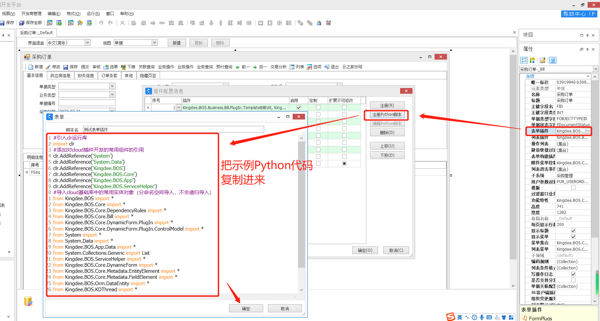

言归正传，前面我们学习了Python插件代码的构成"三部曲"，其中比较重要的一部分就是**【方法/函数】，**再结合上一篇我们学习的插件中对单据的数据包进行操作，就可以实现具体功能了，后面我们将学习各类插件，其实就是学习如何使用【方法/函数】**，**当然，插件中更多的还是学习使用系统定义好的**事件方法，**今天我们先来看一看表单插件中的事件方法。

------

## **一、表单插件简介**

  表单插件是Web服务层插件，**需要依赖于单据维护界面(View)才能触发**，单据列表不会触发，曾经有小伙伴多次遇到单据下推，下游单据某些数据不能自动生成，就是因为单据转换过程本身是不触发实体服务规则、值更新事件以及表单插件的，遇到一些特别的开发场景需要触发表单插件、实体服务规则、值更新时，有时也会在后台构建单据的界面对象View来进行触发使用(*以后会做这方面的分享*)，现在先讲一些表单插件的基本用法。**
**

  **那么那些业务对象可以使用表单插件呢？**表单插件在单据、动态表单、基础资料中都可以注册。

  在熟知的C#插件中，表单插件的基类是AbstractBillPlugIn，C#插件开发时，需要建一个AbstractBillPlugIn的派生类，来实现表单插件，而在开发Python插件时，在注册表单插件的位置注册Python脚本系统就默认是表单插件了，不需要过多考虑基类，所以我们需要更关注需要实现的事件方法。**
**

## **二、表单插件中的重要成员介绍**

  插件基类为我们提供了许多重要的成员供开发时使用，下面介绍一下常用的一些属性和用法。

  在插件中可以通过**this**关键字来调用这些成员。**
**

- **Context:上下文对象**

  this.Context.UserId;#当前用户ID
  this.Context.UserName;#当前用户名称
  this.Context.UserPhone;#当前用户手机号
  this.Context.CurrentOrganizationInfo.ID;#当前组织Id
  this.Context.CurrentOrganizationInfo.Name;#当前组织名称
  this.Context.DBId;#当前数据中心Id
  this.Context.DataCenterNumber;#当前数据中心编码
  this.Context.DataCenterName;#当前数据中心名称
  this.Context.IpAddress;#客户端本机网络信息:IP、MAC等

- **View:视图层对象,**可理解为当前界面,界面类插件特有，服务类的插件没有这个，View能为开发提供很多特有的功能。

  **①View的常用属性**

  this.View.BillBusinessInfo;#单据的业务逻辑元数据，元数据包含的信息很多,下面列了一下常用的信息
  this.View.BillBusinessInfo.GetBillNoField().FieldName;#单据编号字段名
  this.View.BillBusinessInfo.GetBillStatusField().FieldName;#单据状态字段名
  this.View.BillBusinessInfo.GetBillTypeField().FieldName;#单据类型字段名
  this.View.BillBusinessInfo.GetForm().Id;#单据FormId
  this.View.BillBusinessInfo.MainOrgField.FieldName;#主业务组织字段名
  this.View.BillBusinessInfo.GetEntity("FBillHead").TableName;#单据头表名
  this.View.BillBusinessInfo.GetEntity("实体标识").TableName;#实体主表名
  this.View.BillBusinessInfo.GetEntity("实体标识").SplitTables;#实体所有拆分表

  \#****************************************************************************************************

  this.View.OpenParameter;#表单入口参数
  this.View.OpenParameter.Status;#当前界面状态:0,新增;1,查看;2,修改;
  this.View.OpenParameter.GetCustomParameter("参数标识");#获取单据打开传入的参数

  \#****************************************************************************************************

  this.View.ParentFormView;#获取父页面的View
  this.View.ParentFormView.BillBusinessInfo.GetForm().Id;#父页面的FormId,用来判断单据是从哪里进来的

  **②View的常用方法**

  this.View.GetFormTitle();#获取单据标题
  this.View.SetFormTitle(LocaleValue("新标题"));#修改单据标题**
**

  this.View.GetFormOperation("操作代码");#获取单据的一个操作实例对象
  this.View.InvokeFormOperation("操作代码");#触发单据的某个操作:保存、提交、审核、关闭 等!
  this.View.GetControl[控件类]("控件标识");#获取单据上的控件:按钮、菜单等,可用来设置控件的状态(可见性，锁定性等)
  this.View.InvokeFieldUpdateService("字段标识",行号);#触发字段值更新，单据头字段行号填0
  \#触发实体服务规则，下面2行代码
  obj=BOSActionExecuteContext(this.View);
  this.View.RuleContainer.RaiseDataChanged("字段标识", 字段所在实体行数据包,obj);#触发实体服务规则

  \#显示3种提示信息
  this.View.ShowMessage("绿色背景提示信息");#显示正常提示信息
  this.View.ShowWarnningMessage("黄色背景提示信息");#显示警告提示信息
  this.View.ShowErrMessage("红色背景提示信息");#显示错误提示信息

  \#刷新界面数据，修改实体数据包后需要刷新重新读取，必须传标识，不建议粗暴刷新整个单据

  this.View.UpdateView("字段标识/单据体标识");#刷新界面数据**
**

- **Model:单据数据模型,很重要，单据的实体数据包获取从这里开始，结合上1篇所讲的实体数据包。**

  this.View.Model;#单据数据模型,很重要，单据的实体数据包获取从这里开始，结合上文
  **this.View.Model.DataObject;**#单据的完整数据包，相当于前面讲的单据头实体数据包

  this.View.Model.GetEntryCurrentRowIndex("单据体标识");#获取单据体当前焦点行号
  this.View.Model.GetEntryRowCount("单据体标识");#获取单据体行数
  this.View.Model.CreateNewEntryRow("单据体标识");#为单据体新增一行
  this.View.Model.BatchCreateNewEntryRow("单据体标识",x);#批量为单据体新增x行
  this.View.Model.InsertEntryRow("单据体标识", i);#在第i行前插入1行
  this.View.Model.DeleteEntryRow("单据体标识", i);#删除第i行
  this.View.Model.DeleteEntryData("单据体标识");#清空整个单据体数据

  \#获取第x行(单据头不传x)某字段的值，不同字段类型返回不同类型数据，参考[第3篇](https://vip.kingdee.com/article/335071759478985984?productLineId=1)讲解

  this.View.Model.GetValue("字段标识",x);

  \#更新第x行(单据头不传x)某字段的值，不同字段类型赋值不同类型数据，参考第3篇讲解

  this.View.Model.SetValue("字段标识",x,字段值);
  this.View.Model.SetItemValueByID("字段标识","id",x);#用资料内码id更新第x行资料字段的值
  this.View.Model.SetItemValueByNumber("字段标识","id",x);#用资料编码更新第x行资料字段的值

上面对表单插件常用的一些属性和方法做了一下介绍，其实还有很多，这里篇幅有限，也列举不完，用得最多的基本就在这里了，我们可以发现，**除了第3篇将的实体数据包操作之外，在表单插件中，我们有另外的方法对单据的数据进行操作**，**需要注意的是，表单插件中的这些方法使用的都是标识，而不是绑定实体属性名了**，当然，**在表单插件中实体数据包操作同样适用，并且用的时候也很多，不要觉得表单插件这些方法便捷好理解，就"捡了芝麻丢了西瓜哦！"。**

## **三、新建一个表单插件** 

  **我们先新建一个Python表单插件，然后就可以进行下面讲解的内容进行测试验证啦！**

- **注意：我这里提供一个引用比较全的Python插件示例模板，在附件中可以下载示例代码，复制到BOS里面注册！**
- **Python表单插件注册方法：**如下图所示**，**还是以**采购订单**为例，其他单据类似

  

## **四、表单插件常用事件介绍**

  有了前面讲解的这些单据数据操作方法是不是想赶紧验证一下呢，要在插件中触发这些代码，我们需要通过插件事件来作为入口，表单插件的事件也很多，这里介绍一下表单插件中最常用的一些事件，用来实现常见的需求场景够用啦！**
**

- **表单插件中的基本事件：**自动触发，一定会触发，按顺序触发。

  插件中的事件在单据运行过程中产生的，所以一些事件有固定执行顺序，且在不同阶段才能获取到特定的数据。

  | **单据新增界面打开** | **单据修改/查看打开** | **事件描述**                                                 |
  | -------------------- | --------------------- | ------------------------------------------------------------ |
  | PreOpenForm          | PreOpenForm           | 准备单据打开                                                 |
  | OnInitializeService  | OnInitializeService   | 加载单据插件等，这里可以动态调整插件执行顺序等               |
  | OnSetBusinessInfo    | OnSetBusinessInfo     | 绑定单据元数据                                               |
  | OnSetLayoutInfo      | OnSetLayoutInfo       | 设置单据界面显示信息，如布局等                               |
  | OnCreateDataBinder   | OnCreateDataBinder    | 创建数据源绑定对象                                           |
  | OnInitialize         | OnInitialize          | 单据初始化完毕，在这里可以获取一些控件备用                   |
  | OnBillInitialize     | OnBillInitialize      | 单据初始化完毕                                               |
  | CreateNewData        |                       | 构建新单据初始实体数据，新增才会触发                         |
  | AfterCreateNewData   |                       | 新单据初始实体数据构建完毕,在此可修改单据默认数据            |
  | AfterCreateModelData |                       | 新单据实体数据构建到Model                                    |
  |                      | LoadData              | 开始加载单据实体数据                                         |
  |                      | AfterLoadData         | 加载完单据数据                                               |
  | OnLoad               | OnLoad                |                                                              |
  | BeforeBindData       | BeforeBindData        | 开始绑定实体数据到界面控件                                   |
  | AfterBindData        | AfterBindData         | 绑定实体数据到界面控件完毕，尽量不要在此事件中修改数据，仅修改控件的状态(可见性、锁定性、颜色等) |
  
- **Python插件中如何使用事件**

  ①事件就是定义好的方法，所以使用**def**关键字，后面跟上方法名称、参数列表即可，表单插件的事件一般没有返回值。

  ②事件方法参数：在参数中我们能获取到当前事件应该提供信息，表单插件事件一般只有1个参数，在BOS写会提示。

  ③参数名，用"**e**"即可。

  ④示例：def **AfterCreateModelData**(e): ，注意最后有英文冒号":"结尾，如果忘记Python的语法要点，看[第2篇](https://vip.kingdee.com/article/332534862269551872?productLineId=1)。

- ***\*表单插件中的常用事件用法介绍：\*****下面列出的事件中都可以获取到单据数据包*

\#单据新增界面打开时触发，可以获取到单据初始化之后的数据
\#通常用于对单据新增进行默认值填充，例如，设置默认日期，填充单据体默认数据等

\#应用案例:[Python获取当前用户对应的员工](https://vip.kingdee.com/article/158257867764321280?productLineId=1)
def **AfterCreateModelData**(e):
  billObj = this.Model.DataObject;#单据完整数据包,如需通过实体数据包操作读写数据,可从这里开始取
  this.View.Model.SetValue("FDate", "2022-7-1");#设置默认日期
  \#msg=("{0}").format(this.View.BillBusinessInfo.GetEntity("FBillHead").TableName);
  \#this.View.ShowMessage(msg);

\#界面数据绑定完毕后触发，通常在这里对字段控件状态进行设置
\#例如,[设置颜色](https://vip.kingdee.com/article/298154365838782720?productLineId=1)、设置字段锁定性/可见性、[设置下拉列表动态枚举选项](https://vip.kingdee.com/article/301688378930570752?productLineId=1)等
def **AfterBindData**(e):
  this.View.GetControl("FDate").Enabled=False;#False:锁定,True:解锁
  \#this.View.GetControl("控件标识").Visible=False;#False:隐藏,True:显示

\#单据头菜单点击事件，从参数e中获取菜单标识，来判断是哪个菜单发生了点击
\#这里一定要加判断，只需要监听需要的菜单,多个菜单的话，使用if elif结构,Python中没有Switch结构

\#应用案例:[点击菜单弹出动态表单传递参数到子页面](https://vip.kingdee.com/article/291523970094684160?productLineId=1)
def **BarItemClick**(e):
  key=e.BarItemKey.ToUpperInvariant();#菜单标识大写
  if(key=="TESTBTN1".ToUpperInvariant()):
    msg=("菜单[{0}]点击事件捕捉到了，可以继续菜单的功能啦！").format(key);
    this.View.ShowMessage(msg);
  elif(key=="TESTBTN2".ToUpperInvariant()):
    msg=("菜单[{0}]点击事件捕捉到了，可以继续菜单的功能啦！").format(key);
    this.View.ShowMessage(msg);

\#单据体菜单点击事件，与BarItemClick类似,只不过这个是监听单据体菜单栏
def **EntryBarItemClick**(e):
  key=e.BarItemKey.ToUpperInvariant();
  if(key=="entryTESTBTN1".ToUpperInvariant()):
    msg=("单据体菜单[{0}]点击事件捕捉到了，可以继续菜单的功能啦！").format(key);
    this.View.ShowMessage(msg);
    \#这里通常需要获取当前单据体选中的行)(前面有讲怎么获取)，然后对这一行进行处理

\#按钮控件/超链接控件点击事件
\#例如，点击一个超链接，弹出某个单据等等，在此事件实现

\#应用案例:[子页面关闭返回数据到父页面](https://vip.kingdee.com/article/291524092769768448?fromAction=POST_ARTICLE&productLineId=1)
def **ButtonClick**(e):
  BtnKey=e.Key.ToUpperInvariant();#控件标识大写
  if(BtnKey=="F_ora_LINK".ToUpperInvariant()):
    msg=("按钮[{0}]点击事件捕捉到了，可以继续菜单的功能啦！").format(BtnKey);
    this.View.ShowMessage(msg);

\#单据体行双击事件,使用时一定要判断单据体!!!
\#只捕捉行双击:获取事件参数中的行号即可
\#需要捕捉单元格双击：获取事件参数中的行号和字段标识
def **EntityRowDoubleClick**(e):
  entityKey=e.Key.ToUpperInvariant();#单据体标识大写
  row=e.Row;#双击行号,从0开始
  fldKey=e.ColKey.ToUpperInvariant();#双击单元格字段标识大写
  msg=("单据体[{0}]第[{1}]行,字段[{2}]双击啦！").format(entityKey,row,fldKey);
  this.View.ShowMessage(msg);

\#单据体行点击事件，也就是单据体单行选择事件,使用时一定要判断单据体!!!
\#通过此事件可以知道当前焦点行，通常需要开发切换行处理子单据体数据时使用
def **EntityRowClick**(e):
  entityKey=e.Key.ToUpperInvariant();#单据体标识大写
  row=e.Row;#选择行号,从0开始
  msg=("单据体[{0}]第[{1}]行被选中啦！").format(entityKey,row);
  this.View.ShowMessage(msg);


\#单据体行删除事件，在这个事件里可以最后获取被删除的行数据
\#使用时一定要判断单据体!!!
def **AfterDeleteRow**(e):
  entityKey=e.EntityKey.ToUpperInvariant();#单据体标识大写
  row=e.Row;#删除的行号,从0开始,注意：此时用此行号从单据实体数据包中取的数据已不是删除的行数据了
  deletRowObj=e.DataEntity;#删除的行数据包
  msg=("单据体[{0}]第[{1}]行被删除啦！").format(entityKey,row);
  this.View.ShowMessage(msg);

\#值更新事件，当BOS的值更新与实体服务配置实现不了想要的功能时，就会用到插件值更新事件
\#事件参数中可以获取:发生值更新的字段标识、行号、更新前字段值、更新后字段值
\#注意!!!使用时一定要判断字段标识!!!字段在BOS中勾选【即时触发值更新】才会触发插件值更新事件
def **DataChanged**(e):
  fldKey=e.Field.Key.ToUpperInvariant();#字段标识大写
  if(fldKey<>"ABC"):#注意:示例代码是不等于，实际应使用等于进行判断
    row=e.Row;#字段所在的行号,从0开始，单据头字段为0
    oldValue=e.OldValue;#更新前字段值
    newValue=e.NewValue;#更新后的字段值
    msg=("第[{0}]行字段[{1}]从[{2}]更新成了[{3}]").format(row,fldKey,oldValue,newValue);
    this.View.ShowMessage(msg);


\#资料字段选择前事件,通俗来讲：就是放大镜点击弹出选择列表前触发的事件
\#[用途1](https://vip.kingdee.com/article/157167808605429248?productLineId=1):此用法最多，就是对弹出的选择列表进行动态过滤，控制数据选择范围
\#用途2:控制资料字段录入顺序,例如,可以控制没选供应商，就不能选物料，并弹出提示!
\#[用途3](https://vip.kingdee.com/article/251000369826719488?productLineId=1):非资料类型字段，启用编辑按钮(3个点...)，点击时触发
def **BeforeF7Select**(e):
  \#可以从事件参数中读取的信息
  fldKey=e.FieldKey.ToUpperInvariant();#触发的字段标识大写
  baseFormId=e.FormId;#资料字段的具体资料类型,例如物料，就是BD_Material
  row=e.Row;#字段所在的行号,从0开始，单据头字段为0
  \#通过修改事件参数中的信息,可以实现的功能,一定要判断字段标识
  if(fldKey=="FMATERIALID"):
    supObj=this.View.Model.GetValue("FSupplierId");#使用字段标识,获取供应商
    billObj = this.Model.DataObject;#从单据实体数据包获取也一样,再演示1次,别忘了这种方法
    supObj=billObj["SupplierId"];#使用绑定实体属性
    if(supObj==None):
      this.View.ShowWarnningMessage("请先选择供应商");
      e.Cancel=True;#取消弹出选择列表
      return;#跳出事件方法
    e.IsShowUsed = False;#允许选择禁用的数据
    e.IsShowApproved = False;#允许选择未审核的数据,True表示
    myFilterStr=(" '{0}'='VEN00001' ").format(supObj["Number"]);#拼接过滤条件,按照SQL条件表达式写即可
    e.ListFilterParameter.Filter=myFilterStr;#这里示例：供应商编码='VEN00001'，才会弹出物料，否则弹出空白列表

\#通过编码给资料字段赋值前触发,插进赋值，或者直接将编码粘贴到字段里面
\#在此事件可以对赋值编码进行校验,相当于对BeforeF7Select事件的一个补充
\#BeforeF7Select主要是界面录入时控制数据选择列表，但是通过插件赋值是不会触发的
def **BeforeSetItemValueByNumber**(e):
  fldKey=e.BaseDataField.Key.ToUpperInvariant();#触发的字段标识大写
  Num=e.CurrentSetNumber;#当前赋值的资料编码
  row=e.Row;#字段所在的行号,从0开始，单据头字段为0
  e.IsShowUsed = False;#允许赋值禁用的数据
  e.IsShowApproved = False;#允许赋值未审核的数据,True表示
  e.Filter="";#同样可以拼接过滤条件进行数据范围控制

\#单据界面执行单据操作前触发，例如，保存,提交,审核等，使用时一定要判断操作代码
\#此事件在校验规则之前触发
def **BeforeDoOperation**(e):
  opCode=e.Operation.FormOperation.Operation.ToUpperInvariant();#触发操作代码大写,例如保存:SAVE
  if(opCode=="SAVE"):
    e.Cancel=True;#可以取消触发操作
    this.View.ShowWarnningMessage("取消保存！");
\#单据界面执行单据操作完成后触发，例如，保存,提交,审核等，使用时一定要判断操作代码
def **AfterDoOperation**(e):
  opCode=e.Operation.Operation.ToUpperInvariant();#触发操作代码大写,例如保存:SAVE
  this.View.ShowMessage(**str**(opCode));

好了，表单插件事件就介绍到这里，表单插件事件还有一些没介绍，大家有兴趣的可以找资料研究一下，我这里介绍的都是常用的事件，基本能满足常见需求的实现了。

作者：CQ周玉立

来源：金蝶云社区

原文链接：https://vip.kingdee.com/article/338117169206442496?productLineId=1

著作权归作者所有。未经允许禁止转载，如需转载请联系作者获得授权。

```python
#引入clr运行库
import clr
#添加对cloud插件开发的常用组件的引用
clr.AddReference('System')
clr.AddReference('System.Data')
clr.AddReference('Kingdee.BOS')
clr.AddReference('Kingdee.BOS.DataEntity')
clr.AddReference('Kingdee.BOS.Core')
clr.AddReference('Kingdee.BOS.App')
clr.AddReference('Kingdee.BOS.App.Core')
clr.AddReference('Kingdee.BOS.ServiceHelper')
#导入cloud基础库中的常用实体对象（分命名空间导入，不会递归导入）
from Kingdee.BOS import *
from Kingdee.BOS.Core import *
from Kingdee.BOS.Core.DependencyRules import *
from Kingdee.BOS.Core.Bill import *
from Kingdee.BOS.Core.DynamicForm.PlugIn import *
from Kingdee.BOS.Core.DynamicForm.PlugIn.ControlModel import *
from System import *
from System.Data import *
from Kingdee.BOS.App.Data import *
from System.Collections.Generic import List
from Kingdee.BOS.ServiceHelper import *
from Kingdee.BOS.Core.DynamicForm import *
from Kingdee.BOS.Core.Metadata.EntityElement import *
from Kingdee.BOS.Core.Metadata.FieldElement import *
from Kingdee.BOS.Orm.DataEntity import *

#单据新增界面打开时触发，可以获取到单据初始化之后的数据
#通常用于对单据新增进行默认值填充，例如，设置默认日期，填充单据体默认数据等
def AfterCreateModelData(e):
	billObj = this.Model.DataObject;#单据完整数据包,如需通过实体数据包操作读写数据,可从这里开始取
	this.View.Model.SetValue("FDate", "2022-7-1");#设置默认日期
	#msg=("{0}").format(this.View.BillBusinessInfo.GetEntity("FBillHead").TableName);
	#this.View.ShowMessage(msg);

#界面数据绑定完毕后触发，通常在这里对字段控件状态进行设置
#例如,设置颜色、设置字段锁定性/可见性、设置下拉列表动态枚举选项等
def AfterBindData(e):
	this.View.GetControl("FDate").Enabled=False;#False:锁定,True:解锁
	#this.View.GetControl("控件标识").Visible=False;#False:隐藏,True:显示

#单据头菜单点击事件，从参数e中获取菜单标识，来判断是哪个菜单发生了点击
#这里一定要加判断，只需要监听需要的菜单,多个菜单的话，使用if elif结构,Python中没有Switch结构
def BarItemClick(e):
	key=e.BarItemKey.ToUpperInvariant();#菜单标识大写
	if(key=="TESTBTN1".ToUpperInvariant()):
		msg=("菜单[{0}]点击事件捕捉到了，可以继续菜单的功能啦！").format(key);
		this.View.ShowMessage(msg);
	elif(key=="TESTBTN2".ToUpperInvariant()):
		msg=("菜单[{0}]点击事件捕捉到了，可以继续菜单的功能啦！").format(key);
		this.View.ShowMessage(msg);

#单据体菜单点击事件，与BarItemClick类似,只不过这个是监听单据体菜单栏
def EntryBarItemClick(e):
	key=e.BarItemKey.ToUpperInvariant();
	if(key=="entryTESTBTN1".ToUpperInvariant()):
		msg=("单据体菜单[{0}]点击事件捕捉到了，可以继续菜单的功能啦！").format(key);
		this.View.ShowMessage(msg);
		#这里通常需要获取当前单据体选中的行)(前面有讲怎么获取)，然后对这一行进行处理

#按钮控件/超链接控件点击事件
#例如，点击一个超链接，弹出某个单据等等，在此事件实现
def ButtonClick(e):
	BtnKey=e.Key.ToUpperInvariant();#控件标识大写
	if(BtnKey=="F_ora_LINK".ToUpperInvariant()):
		msg=("按钮[{0}]点击事件捕捉到了，可以继续菜单的功能啦！").format(BtnKey);
		this.View.ShowMessage(msg);

#单据体行双击事件,使用时一定要判断单据体!!!
#只捕捉行双击:获取事件参数中的行号即可
#需要捕捉单元格双击：获取事件参数中的行号和字段标识
def EntityRowDoubleClick(e):
	entityKey=e.Key.ToUpperInvariant();#单据体标识大写
	row=e.Row;#双击行号,从0开始
	fldKey=e.ColKey.ToUpperInvariant();#双击单元格字段标识大写
	msg=("单据体[{0}]第[{1}]行,字段[{2}]双击啦！").format(entityKey,row,fldKey);
	this.View.ShowMessage(msg);
	
#单据体行点击事件，也就是单据体单行选择事件,使用时一定要判断单据体!!!
#通过此事件可以知道当前焦点行，通常需要开发切换行处理子单据体数据时使用
def EntityRowClick(e):
	entityKey=e.Key.ToUpperInvariant();#单据体标识大写
	row=e.Row;#选择行号,从0开始
	msg=("单据体[{0}]第[{1}]行被选中啦！").format(entityKey,row);
	this.View.ShowMessage(msg);

#单据体行删除事件，在这个事件里可以最后获取被删除的行数据
#使用时一定要判断单据体!!!
def AfterDeleteRow(e):
	entityKey=e.EntityKey.ToUpperInvariant();#单据体标识大写
	row=e.Row;#删除的行号,从0开始,注意：此时用此行号从单据实体数据包中取的数据已不是删除的行数据了
	deletRowObj=e.DataEntity;#删除的行数据包
	msg=("单据体[{0}]第[{1}]行被删除啦！").format(entityKey,row);
	this.View.ShowMessage(msg);

#值更新事件，当BOS的值更新与实体服务配置实现不了想要的功能时，就会用到插件值更新事件
#事件参数中可以获取:发生值更新的字段标识、行号、更新前字段值、更新后字段值
#注意!!!使用时一定要判断字段标识!!!字段在BOS中勾选【即时触发值更新】才会触发插件值更新事件
def DataChanged(e):
	fldKey=e.Field.Key.ToUpperInvariant();#字段标识大写
	if(fldKey<>"ABC"):#注意:示例代码是不等于，实际应使用等于进行判断
		row=e.Row;#字段所在的行号,从0开始，单据头字段为0
		oldValue=e.OldValue;#更新前字段值
		newValue=e.NewValue;#更新后的字段值
		msg=("第[{0}]行字段[{1}]从[{2}]更新成了[{3}]").format(row,fldKey,oldValue,newValue);
		this.View.ShowMessage(msg);

#资料字段选择前事件,通俗来讲：就是放大镜点击弹出选择列表前触发的事件
#用途1:此用法最多，就是对弹出的选择列表进行动态过滤，控制数据选择范围
#用途2:控制资料字段录入顺序,例如,可以控制没选供应商，就不能选物料，并弹出提示!
#用途3:非资料类型字段，启用编辑按钮(3个点...)，点击时触发
def BeforeF7Select(e):
	#可以从事件参数中读取的信息
	fldKey=e.FieldKey.ToUpperInvariant();#触发的字段标识大写
	baseFormId=e.FormId;#资料字段的具体资料类型,例如物料，就是BD_Material
	row=e.Row;#字段所在的行号,从0开始，单据头字段为0
	#通过修改事件参数中的信息,可以实现的功能,一定要判断字段标识
	if(fldKey=="FMATERIALID"):
		supObj=this.View.Model.GetValue("FSupplierId");#使用字段标识,获取供应商
		billObj = this.Model.DataObject;#从单据实体数据包获取也一样,再演示1次,别忘了这种方法
		supObj=billObj["SupplierId"];#使用绑定实体属性
		if(supObj==None):
			this.View.ShowWarnningMessage("请先选择供应商");
			e.Cancel=True;#取消弹出选择列表
			return;#跳出事件方法
		e.IsShowUsed = False;#允许选择禁用的数据
		e.IsShowApproved = False;#允许选择未审核的数据,True表示
		myFilterStr=(" '{0}'='VEN00001' ").format(supObj["Number"]);#拼接过滤条件,按照SQL条件表达式写即可
		e.ListFilterParameter.Filter=myFilterStr;#测试设置了，供应商编码='VEN00001'，才会弹出物料，否则弹出空白列表

#通过编码给资料字段赋值前触发,插进赋值，或者直接将编码粘贴到字段里面
#在此事件可以对赋值编码进行校验,相当于对BeforeF7Select事件的一个补充
#BeforeF7Select主要是界面录入时控制数据选择列表，但是通过插件赋值是不会触发的
def BeforeSetItemValueByNumber(e):
	fldKey=e.BaseDataField.Key.ToUpperInvariant();#触发的字段标识大写
	Num=e.CurrentSetNumber;#当前赋值的资料编码
	row=e.Row;#字段所在的行号,从0开始，单据头字段为0
	e.IsShowUsed = False;#允许赋值禁用的数据
	e.IsShowApproved = False;#允许赋值未审核的数据,True表示
	e.Filter="";#同样可以拼接过滤条件进行数据范围控制
	
#单据界面执行单据操作前触发，例如，保存,提交,审核等，使用时一定要判断操作代码
#此事件在校验规则之前触发
def BeforeDoOperation(e):
	opCode=e.Operation.FormOperation.Operation.ToUpperInvariant();#触发操作代码大写,例如保存:SAVE
	if(opCode=="SAVE"):
		e.Cancel=True;#可以取消触发操作
		this.View.ShowWarnningMessage("取消保存！");
#单据界面执行单据操作完成后触发，例如，保存,提交,审核等，使用时一定要判断操作代码
def AfterDoOperation(e):
	opCode=e.Operation.Operation.ToUpperInvariant();#触发操作代码大写,例如保存:SAVE
	this.View.ShowMessage(str(opCode));
```