## 背景
去年疫情影响，深圳市政府人力资源和社会保障局出台了“以工代训”补贴政策，这个项目我做完了后在一体化平台查询到有公示，但具体不清楚是哪天公示的（公示通过后次月月底前财政拨款）、哪天拨款到公司账户。大家都能想到的方法是去人力资源网站查询了，我也是普通人，也是这么干的，但是打开公示信息栏看到的是这样的，具体在哪在一百多批中的哪批呢. 
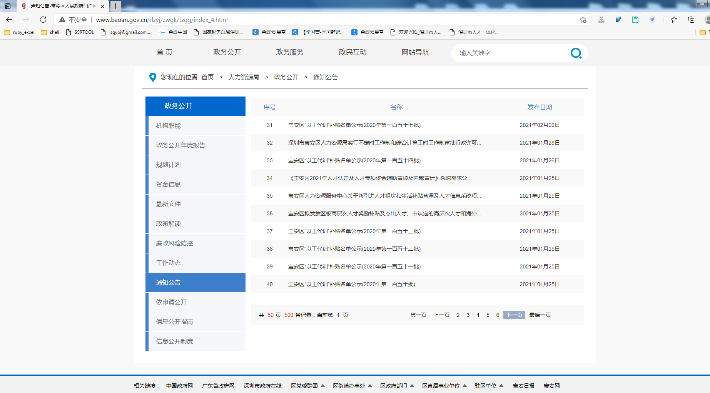
常见做法有：

1. 一个一个下载打开查找
2. 一个一个下载，然后用VBA（遍历循环下载工作薄，提取符合内容）
3. 爬虫人力资源网站，下载所有表格，Power Query合并查询
4. 直接爬虫人力资源网站直接读取表格内容，抓取符合内容
5. 其他更好的方法（欢迎指导）

**方法3**过年在家空闲时间已经实现，鉴于时间没有整理成文，现记录以供同仁相互切磋；方法3主要记录Power Query的用法，至于Spider内容有兴趣的可以相互学习。

## 数据处理
#### 工具准备

1. **RubyInstaller**安装
2. **Gems**安装
3. **Excel 2016**及以上版本（低版本不包含**Power Query**）

##### STEP 1.  RubyInstaller安装

 RubyInstaller可以在官网上下载，为方便更快下载，可以由[上海交通大学软件源镜像服务](https://mirrors.sjtug.sjtu.edu.cn/)提供所有镜像[rubyinstaller2](https://mirror.sjtu.edu.cn/github-release/oneclick/rubyinstaller2/releases/download/?mirror_intel_list)存档中下载，或者通过[rubyinstaller.cn](https://rubyinstaller.cn/downloads/)下载**Ruby+Devkit 2.7.X**或者**Ruby+Devkit 3.0.X**

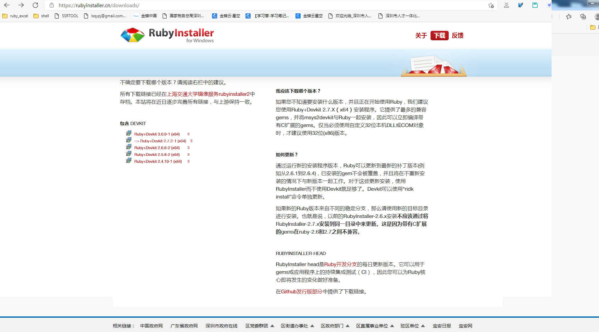
<!--


or-->


##### STEP 2. Gems安装

1. 更新gem

```shell
gem update --system
gem sources --add https://gems.ruby-china.com/ --remove https://rubygems.org/
gem sources -l
https://gems.ruby-china.com
# 确保只有 gems.ruby-china.com
```

2. 安装依赖

```shell
gem install mechanize
git clone https://github.com/songjiz/aria2-ruby
cd aria2-ruby
gem build aria2.gemspec
gem install *.gem
```

3. 安装aria2多线程加速下载工具

aria2配置文件[下载地址](https://github.com/lsq/blogsr/tree/master/content/posts/ygdx/aria2-windows.conf)，配置文件可以参考[P3TERX/aria2.conf](https://github.com/P3TERX/aria2.conf)

编译参考[aria2-build-msys2](https://github.com/myfreeer/aria2-build-msys2)、[aria2-static-builds](https://github.com/q3aql/aria2-static-builds)、[Aria2-Pro-Core](https://github.com/P3TERX/Aria2-Pro-Core)

```shell
git clone https://github.com/P3TERX/aria2.sh
cd aria2.sh
bash aria2.sh
git clone https://github.com/P3TERX/aria2.conf
mv aria2.conf ~/.aria2
aria2c --conf-path=~/.aria2.conf
```

#### 下载表格

主要是爬虫人力资源网站公示信息中包含“以工代训”链接，并打开链接下载公示表格

代码用ruby写的，[下载链接](https://github.com/lsq/blogsr/tree/master/content/posts/ygdx/getFiles.rb)
```shell
ruby getFile.rb
# 大概10s左右下载完
```

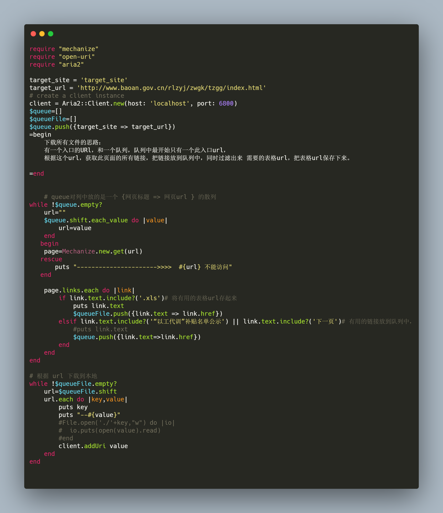

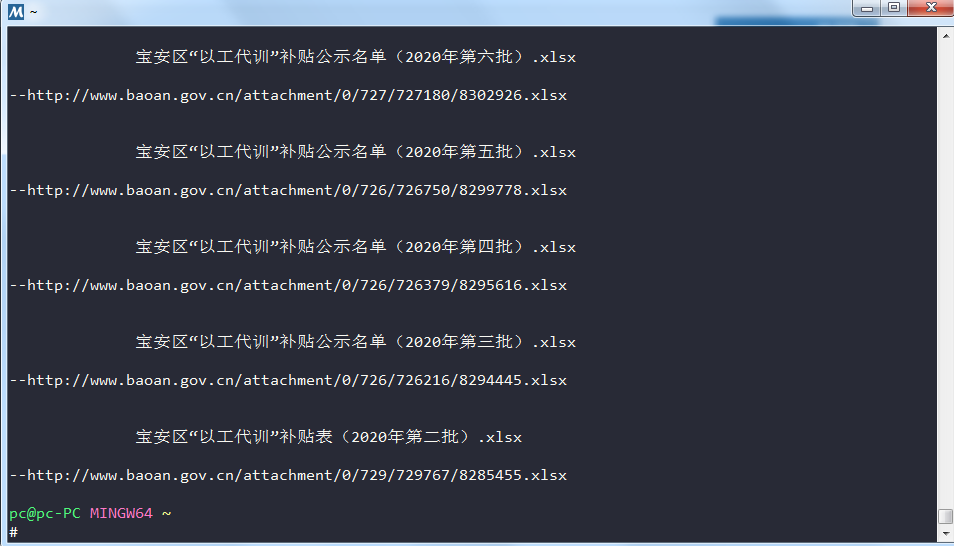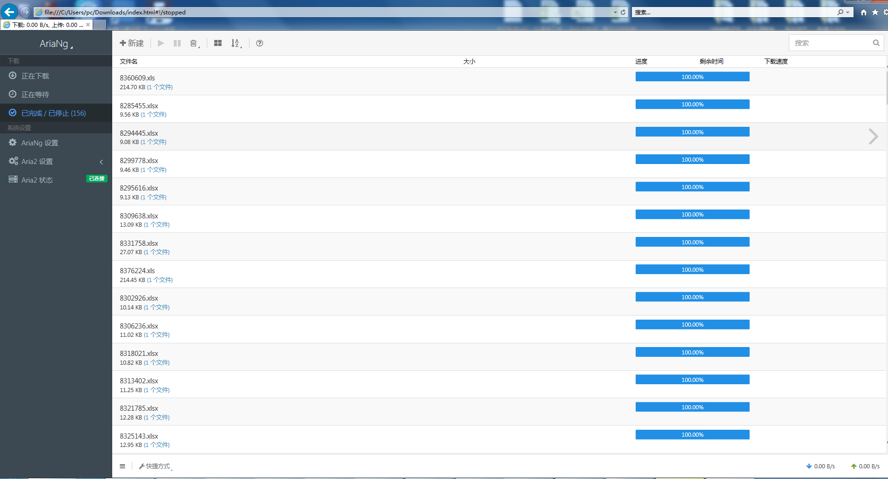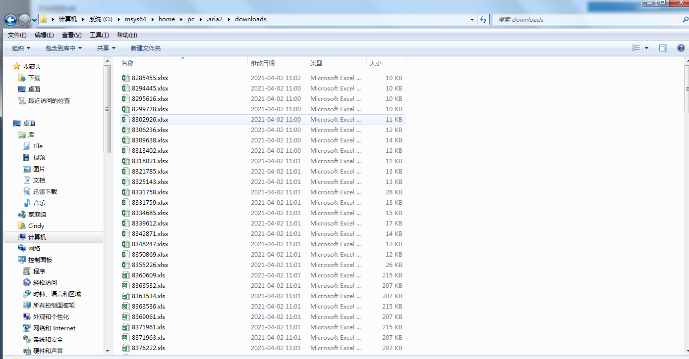

#### Power Query 查询数据

##### 查询代码

````haskell
let
    // 查询文件夹目录，根据你存放的位置修改
    源 = Folder.Files("C:\Users\pc\Desktop\项目补贴资料\巴达木2020年以工代补补贴资料\公示"),
    //pa = Table.AddColumn(源, "路径", each [Folder Path] & [Name]),
    //sourcetable = Table.AddColumn(pa, "SourceTable", each Web.Page(File.Contents([路径]))),
    sourcetable = Table.AddColumn(源, "SourceTable", each Web.Page([Content])),    
    #"展开的“SourceTable”" = Table.ExpandTableColumn(sourcetable, "SourceTable", {"Caption", "Source", "ClassName", "Id", "Data"}, {"Caption", "Source", "ClassName", "Id", "Data"}),
    筛选的行 = Table.SelectRows(#"展开的“SourceTable”", each ([Source] = "Table")),
    pici = Table.AddColumn(筛选的行, "批次", each [a=[Data]{0}[Column1]][a]),
    #"展开的“Data”" = Table.ExpandTableColumn(pici, "Data", {"Column1", "Column2", "Column3", "Column4", "Column5", "Column6"}, {"Column1", "Column2", "Column3", "Column4", "Column5", "Column6"}),
    删除的其他列 = Table.SelectColumns(#"展开的“Data”",{"Name", "Column1", "Column2", "Column3", "Column4", "批次"}),
    重排序的列 = Table.ReorderColumns(删除的其他列,{"Name", "批次", "Column1", "Column2", "Column3", "Column4"}),
    筛选的行1 = Table.SelectRows(重排序的列, each ([Column1] <> "序号" and [Column1] <> "合计" and Text.Start([Column1],2) <> "宝安")),
    重命名的列 = Table.RenameColumns(筛选的行1,{{"Column1", "序号"}, {"Column2", "单位名称"},{"Column3", "公示人次"},{"Column4", "公示金额（元）"}})
in
    重命名的列
````

##### 查询操作步骤

STEP **1**. 新建一个空白工作薄“公示查询”，打开并切换到《**数据**》标签页面，然后选择”**新建查询**“》”**其他源**“》”**空白查询**“，打开”**高级编辑器**“

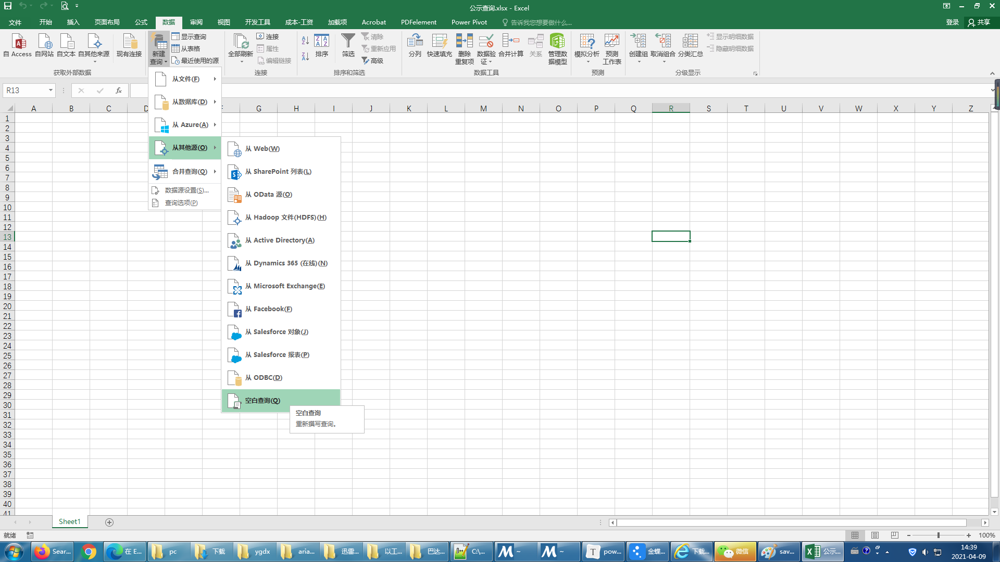
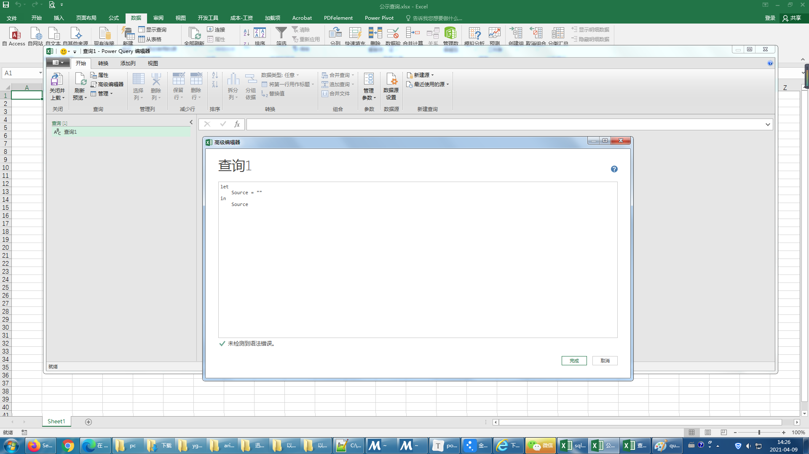


STEP **2**.全选并删除默认查询代码，然后粘贴**查询代码**，最后点击”**完成**“，就会出现查询结果，此步骤**注意**个改查询代码中的目录位置(**源**中的路径)
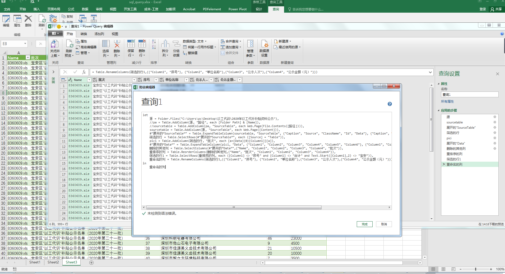
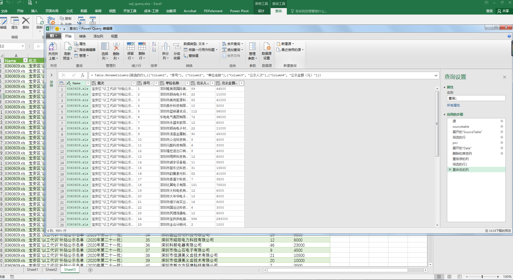


STEP **3**.点击左上角“**关闭并上载**”下的**箭头**，选择“**关闭并上载至...**”选项，选择“**现有工作表**”，“**加载**”后就是最终结果。
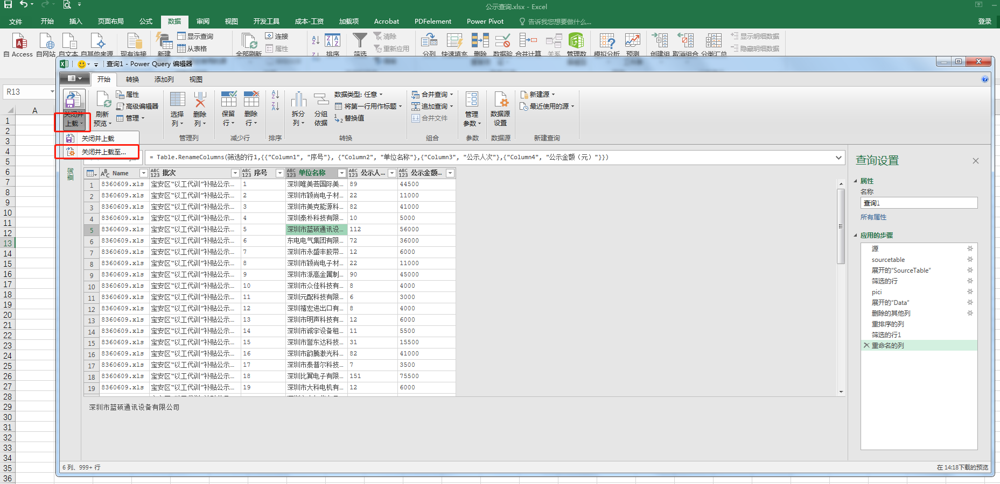
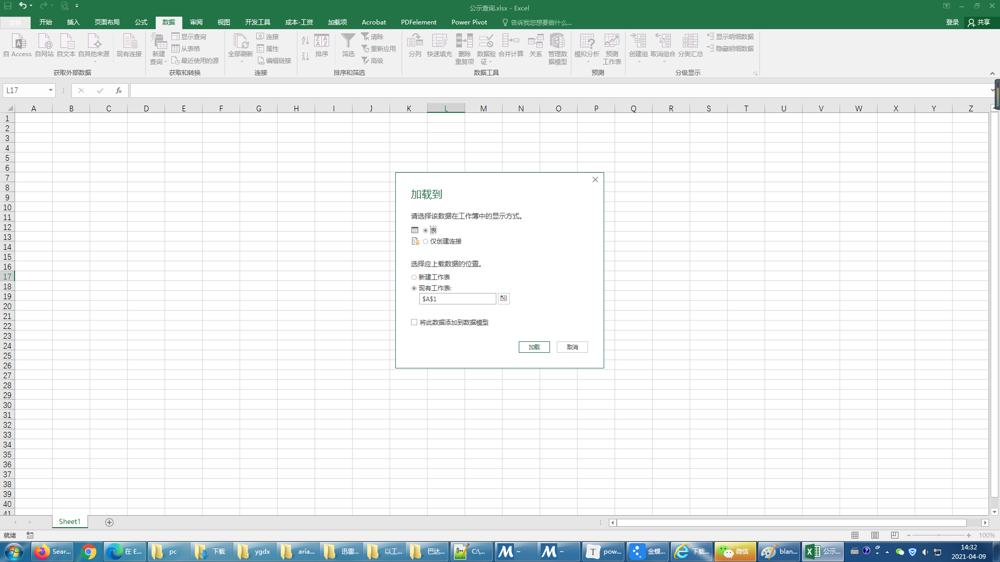
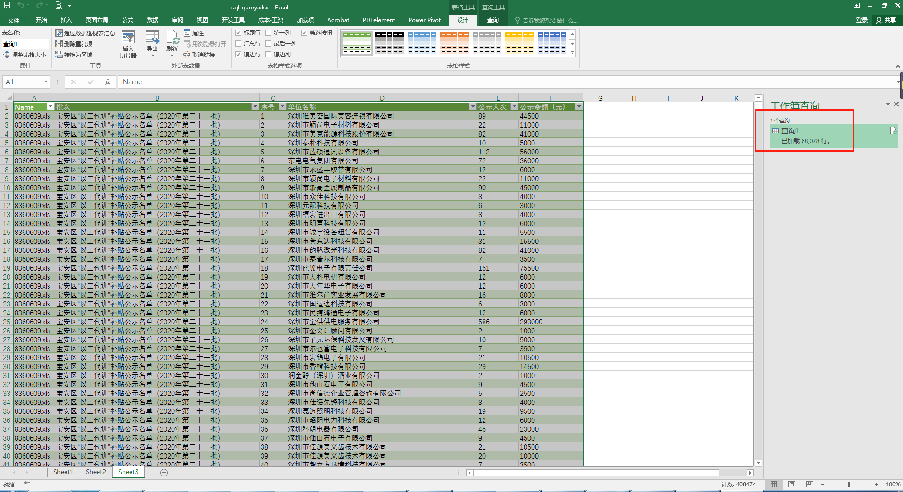