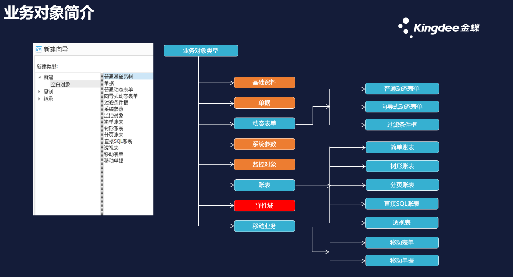
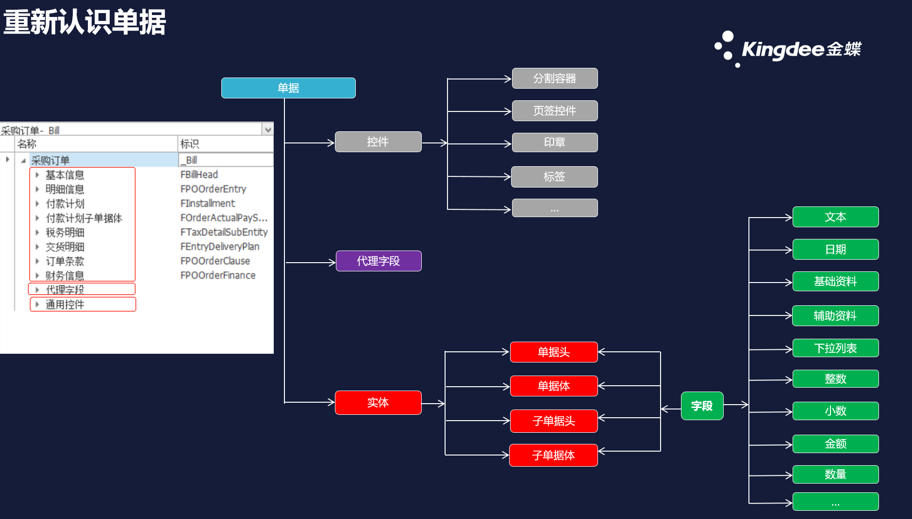
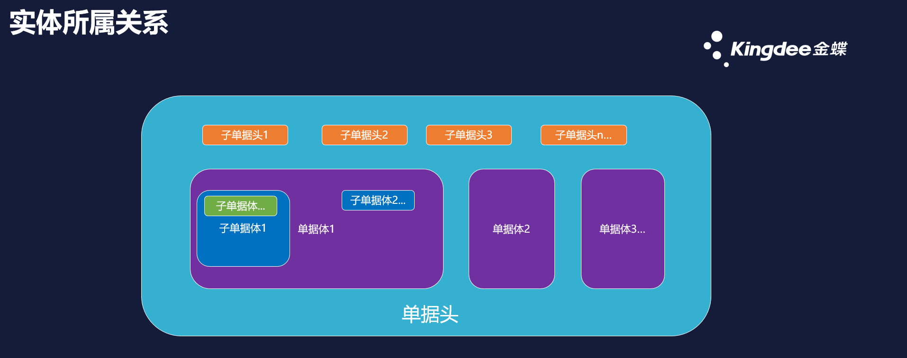
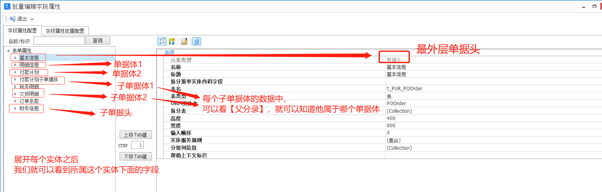
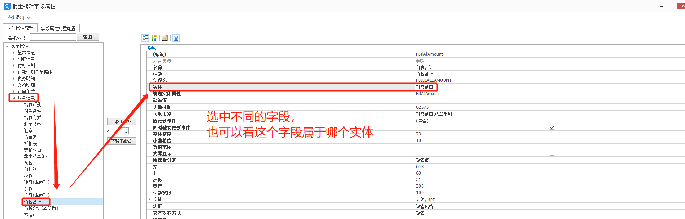
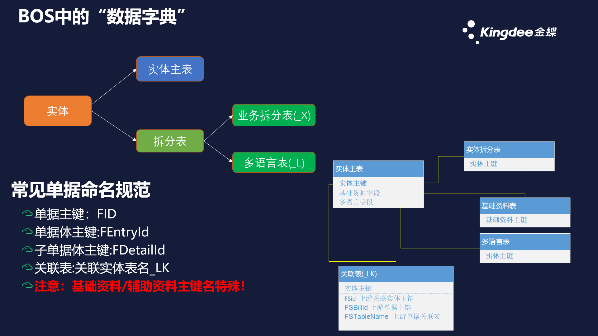
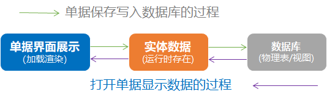

上一篇：[**第2篇：基本开发过程介绍**](https://vip.kingdee.com/article/332534862269551872?productLineId=1) 

  大家好，今天我们来讲一讲如何在插件中如何进行数据操作，实现一个开发功能，无非是对数据进行各种逻辑处理，那么我们要学会插件开发，必然要学会如何对单据的数据进行取值、赋值，所以**这一篇是重中之重，毫不夸张的讲，如果不理解这一篇所讲解的内容，将很难学会Python插件开发**，大家也不用担心，跟着我的思路一步一步来理解，一定能明白的！

大家一定要先看下面这2篇文章，特别是没有插件基础或者基础薄弱的小伙伴：

- [*关于BOS中的标识、字段名、实体属性名的开发应用简介*](https://vip.kingdee.com/article/283981316536560128?productLineId=1)
- [*知识共享 - 单据数据包DynamicObject的结构及操作*](https://vip.kingdee.com/article/35736?productLineId=1)

看了以上2篇文章，再结合本篇的讲解，这部分内容就很容易攻克啦！话不多说，下面进入正文...

------

## **一、单据的实体构成介绍**

- **业务对象**

   对于金蝶云星空系统，大家应该知道的几个概念：业务领域、子系统、业务对象。系统业务功能的构成主要就是通过不同的业务对象组成的。我们先来看下业务对象，下图就是系统中场常见的业务对象类型。



- **重新认识单据**

  虽然系统中有这么多的业务对象类型，但核心都是以单据(也可以称为表单)为基础的，我们来重新认识一下单据的构成。

  下图是一个单据的主要构成，简单来讲单据就是由**布局控件+实体字段**构成。布局控件就是仅用于界面展示，不会存储实际物理数据，而实体字段除了有特定的展示效果之外，更重要的是构成了单据业务数据，会存储到数据库物理表中。我们做插件开发时，除了对界面展示进行一些简单的控制和修改，例如，设置锁定性、可见性、高度、颜色等。更多的还是对单据的数据进行各种处理，所以这一篇主要就是来介绍在插件中如果对单据实体数据进行操作。



看了这张图的分解，是不是有种感觉："单据其实用来用去也就那么回事！"

- **对实体的理解**

**我们聚焦到今天的重点**--单据**实体**数据，看到红色的内容。**系统中的实体就只有上图中的4种**。对于实体，我们可以这样理解，实体是一层一层的，多个实体组合成了一个单据，就像做一页PPT(*为了帮助理解，做一下类比，不恰当之处还望海涵，能理解知识就好*)：

- 最外层有一个底页(**相当于是单据头，代表了整个单据**)，最简单直接的，可以直接在底页中添加文本编辑框(相当于单据头字段);
- 我们可以加入多个形状对整个 PPT的页面进行分区(加入**子单据头**，把单据头信息进行拆分)，可以把一些信息内容进行归类，放到不同的形状里面(**把字段加到子单据头**);
- 然后我们想在PPT中用一个表格来展示销售业绩，于是又插入了一个表格(相当于是**单据体**)，然后对表格添加列，构成了表格的列头(**单据体字段**)，假设我们加入了：产品名称、月份、销售金额。然后就是一行一行的产品销售数据展示出来了。
- 这时发现，这个销售业绩数据不够细，只展示了每项产品的销售总金额，把每个产品分别销售给了哪些客户也展示出来吧。然后就对表格进行加工，把一行产品数据展示成多行，然后产品名称合并单元格，形成了一个树形表格，但是这个表格好像太长了，看起来太复杂。于是，可以把表格分成多个表，保留原来的产品销售汇总表，然后再把每个产品的客户销售明细都列出来(**子单据体**)，分别对应每一行产品数据。这样把汇总数据和明细数据分开展示了。

**看了上面的类比，大概可以知道这几种实体间的所属关系了吧。**

- **1个单据对应1个单据头**
- **1个单据头对应n个子单据头**
- **1个单据头对应n个单据体**
- **1个单据体对应n个子单据体(一般不建议这样设计)**
- **1个子单据体还可以挂n个下级子单据体，树形展开下去(\**一般不建议这样设计\**)**

**这里要注意一点**：子单据头可以直接与单据头进行关联，存在一对一的关联关系，但是不同的单据体分录之间是没有直接关联关系的，只是属于同一单据而已。而子单据体分录必须和父单据体进行直接关联，然后才能关联到单据头，不能与其他实体之间直接关联，并且不同子单据体之间分录也没有直接关联关系。

通俗理解：单据头是父亲，子单据头是儿子，单据体是儿子，子单据体是孙子。父亲和儿子之间有直接关系，兄弟之间没有直接关系，爷爷和孙子之间也没有直接关系。

**实体字段都是放在这些实体中的！所以在插件中操作单据数据的核心就是要对实体进行操作。**



**我们在BOS中打开一个单据来看下单据的实体结构，点开【批量编辑字段属性】即可查看实体结构，以采购订单为例：**





- **扩展知识**

看到这里，我想很多小伙伴肯定会想到单据在数据库中的表结构，没错！单据的数据库表结构也是根据实体的结构来生成的，数据库表结构是另一方面的知识了，这个不是我们今天讲解的重点，这里作为扩展知识顺便分享一下，见下图。



## **二、Python插件中对实体数据包的操作**

​    在单据操作过程中，我们基本可以按下图来理解单据数据的流转过程。

****

**所以我们读取/更新单据数据的方式也有三种：**

①从界面上读取/更新，只能在界面类的插件中使用。

②从单据体的实体数据中读取/更新。

③直接通过SQL从数据库读取/更新。

**在插件中对单据的数据进行操作时，大多数情况都是在实体数据这一层处理的。所以我们必须要掌握：**

单据的实体数据包结构是怎样的？

如何获取单据的实体数据包？

如何从单据数据包取值？

如何修改单据的数据包？

如果将单据的数据包显示到界面上？

如果将数据包保存到数据库？

**下面我们就来学习一下单据的实体数据包如何操作：**

实体数据包主要是**DynamicObject**对象，可以称为动态数据对象，Python没有数据类型定义，但是当我们在Python插件中获取到单据的实体数据包之后，我们要知道取到的是一个DynamicObject对象。

- **那么我们先来认识一下DynamicObject**

看了前面建议必读的2篇文章之后，应该比较清楚了，这里再整合介绍一下：

1. [丁老师的文章](https://vip.kingdee.com/article/35736?productLineId=1)里面介绍到：DynamicObject相当于一个**有层次结构的数据字典。**有层次怎么理解？其实就DynamicObject里面有很多层，是通过**键值对**的方式构成的，而每个值是有不同的数据类型的，当然也会存在DynamicObject对象类型的值，所以就形成了DynamicObject多层展开的数据结构。字典的key对应的就是字段的实体属性标识。
2. 如果觉得字典不好理解，可以看文章开头建议的[另一篇文章](https://vip.kingdee.com/article/283981316536560128?productLineId=1)中的介绍，初学者可以类比JSON对象来进行理解，可以通过实体属性标识对数据包里面的字段进行读写。DynamicObject可以相当于一个JSON对象，数据包里面的字段有多种类型，读写的时候，需要"一层一层剥开"去进行操作。与JSON不同之处在于,每一个DynamicObject都有自己特定的类型，对应了自己的一个结构，**这个就是由单据体实体结构决定的**，数据包里面的字段属性就是他包含的所有实体属性名，不能像JSON那样随意添加、删除字段属性。 

- **认识\**DynamicObject\******之后，我们来看一下如何一层一层解析**

首先我们需要拿到单据头的实体数据包，相当于就拿到了最外层完整的单据数据包，获取单据实体数据包的方法有很多种，对于不同的插件，甚至事件不同，获取单据数据包的方法也不同。这个在后续各类型插件的讲解中会逐一介绍。**但是拿到数据包之后的操作方法都是一样的**，这里我们先以表单插件为例，看看Python插件中如何解析**DynamicObject数据。**

**我们先建立一个Python表单插件作为演示，以采购订单的数据为例：**

(完整示例代码可下载附件，这里只列出关键代码进行介绍)

- **解析数据包时，必须知道对应的key，这个key是在BOS单据中查看的，先看前面的文章了解[单据各种标识的介绍](https://vip.kingdee.com/article/283981316536560128?productLineId=1)**
- **注意!**读取**子单据头、单据体、子单据体**时，使用的是**ORM实体名**，**读取字段时**，使用的是**绑定实体属性。**

**我们根据数据包里面的这些key就读取/修改对应的值Value,别忘了，前面也讲了，不同的值也是有不同的数据类型的。**

- **解析代码格式：**通过“**DynamicObject数据变量["标识key"]**”就可以读取到对应的值了**（注意区别大小写）。**

- **获取单据头数据包:billObj**就是一个DynamicObject数据变量，自定取的一个变量名，满足Python语法规范即可。

  ```billObj = this.View.Model.DataObject;#单据头的数据包，即单据的数据包，DynamicObject类型，可进一步解析```

- **读取单据编号：**单据编号属于单据头的字段，直接从单据头数据包中读取，key是BillNo

  ```billNo=billObj["BillNo"];#字符串类型```

- **读取单据ID(内码)：**读取实体的内码Id，直接从实体数据包中读取，key固定是Id

  ```billId=billObj["Id"];#整数类型```

- **读取采购日期**：采购日期属于单据头字段，直接从单据头数据包中读取，key是Date

​    ```billNo=billObj["Date"];#日期类型```

- **读取供应商**：供应商属于单据头字段，直接从单据头数据包中读取，key是SupplierId

​    ```supplierObj=billObj["SupplierId"];#DynamicObject类型，基础资料、组织、辅助资料取值均是DynamicObject```

**注意：**当字段类型是基础资料或者辅助资料时，直接获取到的是资料的数据包(相当于基础资料单据头的数据包)，也是一个**DynamicObject类型**。如果进一步获取基础资料的属性属性，再往下一层解析获取即可。

**需要进一步注意的是：**

①考虑到性能问题，单据不会加载完整的基础资料数据包，需要获取的字段先要在【引用属性】里面添加！

②读取资料字段DynamicObject里面的数据时候，需要判断字段是否为空，**示例：if(supplierObj<>None)**

- **读取供应商编码**：供应商编码属于**供应商里面单据头的字段**，要从供应商数据包中读取，通过查看供应商BOS单据可以知道，供应商编码的key是Number

   ``` supplierNum=("{0}").format(supplierObj["Number"]);#字符串类型，直接转换成字符串使用```

- **读取供应商名称**：供应商名称属于**供应商里面单据头的字段**，要从供应商数据包中读取,key是Name

​    ```supplierName=("{0}").format(supplierObj["Name"]);#多语言文本，可以直接转换成字符串使用```

- **读取供应商ID(内码)**：资料字段的ID读取有2种方法，一种是从实体数据包中读取，另一种是从资料数据包中读取

​    \#①从实体数据包中直接读取，实体数据包中，单独构建了资料字段的ID，**key是固定格式:"资料字段属性key_Id"**

​    \#供应商所属实体是单据头，直接可以从单据头中读取，供应商的key是SupplierId,对应ID的key是:**SupplierId_Id**

​    ```supplierId=("{0}").format(**billObj**["SupplierId_Id"]);#整数，可以直接转换成字符串使用```

​    \#②从基础资料数据包中读取

​    ```supplierId=("{0}").format(**supplierObj**["Id"]);#整数，可以直接转换成字符串使用```

- **读取供应商里面的付款条件**：付款属于**供应商里面财务信息子单据头的字段，要从供应商数据包中逐层获取**

​    \#先获取供应商的财务信息子单据头，key是SupplierFinance,取的是一个DynamicObject集合，集合中只有1个元素

​     ```supplierFinObj=supplierObj["SupplierFinance"];#DynamicObjectCollection类型```

​    \#再从供应商-财务信息子单据头获取付款条件,付款条件字段的key是PayCondition

```python
payConditionId=supplierFinObj[0]["PayCondition_Id"];#付款条件Id,整数类型
payConditionObj=supplierFinObj[0]["PayCondition"];#付款条件Id,整数类型
```

**看了上面单据头供应商字段的逐层解析 ，有点感觉了吧，我们不继续往下层取了，回到采购订单。**

- ***\*读取采购订单表头价税合计\**：**表头价税合计属于财务信息子单据头的字段

​    \#先从最外层单据头数据包中获取财务信息子单据头，key是POOrderFinance

​     `FinObj=billObj["SupplierFinance"];#DynamicObjectCollection类型`

​    \#再从财务信息子单据头获取价税合计，key是BillAllAmount

​     `payConditionId=FinObj[0]["BillAllAmount"];#浮点数类型`

**前面的示例中提到了子单据头，子单据头实体取到的是一个DynamicObjectCollection。**

有点不一样，其实也很简单，DynamicObjectCollection是DynamicObject的集合，相当于是DynamicObject对象列表或者DynamicObject对象数组，它里面可以有1个或者多个DynamicObject。

**而子单据头这个集合里面固定只有一个元素。使用的时候注意一下就行。**

**对于单据体，也是\**\*\*DynamicObjectCollection，且会有\*\**\*多个\**DynamicObject，每一个\*\*DynamicObject代表一行数据，所以，通常我们需要用循环来对单据体的每一行数据进行操作。\*\**\***

- **读取采购订单明细**：明细信息是一个单据体，它属于单据头，直接从最外层单据头数据包读取

​    `entity=billObj["POOrderEntry"];#订单明细单据体,DynamicObjectCollection类型`

- ***\*循环读取\*\*采购订单明细\*\*：\****单据体行，又是一个DynamicObject，每1行当成一个个单据头来解析就行了
```python
    for rObj in entity:
​      entryId=rObj["Id"];#明细ID内码，单据未保存时，为0
​      matObj=rObj["MaterialId"];#物料数据包,DynamicObject类型,可进一步解析
​      matId=rObj["MaterialId_Id"];#物料Id获取方式1
​      matId=matObj["Id"];#物料ID获取方式2
​      matNum=matObj["Number"];#物料编码,字符串类型
​      matNam=("{0}").format(matObj["Name"]);#物料名称，多语言文本,直接转换成字符串使用
​      Qty=rObj["Qty"];#采购数量，浮点数类型
​      taxPrice=rObj["TaxPrice"];#含税单价,浮点数类型
```
- ***\*读取交货明细子单据体：子单据体属于父分录单据体的行数据包，要从行数据包中读取\****

​    ***\*取出来的也是\****DynamicObjectCollection，又当成1个单据体来解析就行。交货明细key:POOrderEntryDeliPlan

​    **子单据体读取方式1（不推荐，可以试试）：**
```python
    for rObj in entity:
​      subEntity=rObj["POOrderEntryDeliPlan"];#交货明细子单据体，DynamicObjectCollection类型
​      for subRowObj in subEntity:
​        subEntryId=subRowObj["Id"];#子单据体行ID内码，整数
​        deliveryDate=subRowObj["PlanDeliveryDate"];#计划交货日期，日期类型

​     **子单据体读取方式2（推荐，常用方式）：**思路不变，只是通过子单据体元素的元数据获取

​    \#需要添加引入:from Kingdee.BOS.Core.Metadata.EntityElement import *

​    \#注意获取元素元数据时，使用的是标识FEntryDeliveryPlan

​    subEn = this.View.BillBusinessInfo.GetEntity("FEntryDeliveryPlan");#SubEntryEntity类型

​    for rObj in entity:
​      subEntity = subEn.DynamicProperty.GetValue(rObj);#把父分录的行数据包传进去,子单据体数据包,DynamicObjectCollection类型
​      for subRowObj in subEntity:
​        subEntryId=subRowObj["Id"];#子单据体行ID内码，整数
​        deliveryDate=subRowObj["PlanDeliveryDate"];#计划交货日期，日期类型
```
**前面已经将实体数据包的读取操作讲完了，那怎么更新数据包呢？**

实体数据包是在运行时存在，相当于内存中的数据结构，修改也很简单，直接赋值就可以了。

**需要注意3点：**

  ①对于只读类型的字段不能进行赋值操作，例如，基础资料属性字段，基础资料数据包里面的字段等。

  ②实体ID内码，这个是由系统统一管理的，不到万不得已，不要去修改，慎行！

  ③前面也反复强调不同值有不同的数据类型，赋值的时候要赋予对应的数据类型。例如，数量字段应该赋值小数，日期字段应该赋值日期，字符串字段应该赋值字符串，**DynamicObject数据包字段应该赋值数据包**等等。
```python
    billObj["BillNo"]="test001";#修改单据编号
​    for rObj in entity:
​      matId=1001;#这里是随手写的一个整数，实际情况要写系统中可用的物料ID
​      \#根据物料Id获取物料数据包
​      matFld=this.View.BillBusinessInfo.GetField("FMaterialId");#物料字段元素元数据,使用字段标识
​      matObj=BusinessDataServiceHelper.LoadSingle(this.Context, matId, matFld.RefFormDynamicObjectType);
​      \#注意：对资料类型的字段赋值时，需要2行代码，既要给实体里面资料ID赋值，也要给资料数据包赋值

​       rObj["MaterialId_Id"]=matId;#物料Id赋值
​      rObj["MaterialId"]=matObj;#物料数据包赋值
​      rObj["Qty"]=100;#修改采购数量
​      rObj["TaxPrice"]=10;#修改含税单价
```
\#如果是表单插件，修改完实体数据包之后，要执行UpdateView刷新界面，界面才会显示更新后的数据
```python
    this.View.UpdateView("FBillNo");#刷新单据编号字段
    this.View.UpdateView("FPOOrderEntry");#刷新整个单据体
```
- **实例化，代码构建一个DynamicObject**

​    对于DynamicObject对象，可以通过billObj.DynamicObjectType来获取它的具体数据类型。

​    对于DynamicObjectCollection对象，可以通过entity.DynamicCollectionItemPropertyType来获取具体数据类型。

​    当我们需要构建一个新的DynamicObject对象时，会用到。

​    例如，为单据体构建一行新的数据(*需要对逐个字段进行赋值，赋值过程不会触发实体服务规则和值更新*):

​    `newRow=**DynamicObject**(entity.DynamicCollectionItemPropertyType);`

​    \#对newRow里面的字段逐个赋值...省略

   ` entity.Add(newRow);`

当然，给实体数据包赋值还有其他的方式，可以通过字段元素元数据来赋值，也更推荐使用这种方式。理解了上面实体数据操作方式之后，通过字段元数据的方式也很好理解。

这里不展开讲解了，可以继续看前面提到的文章参考学习：*[知识共享 - 单据数据包DynamicObject的结构及操作](https://vip.kingdee.com/article/35736?productLineId=1)*

这个文章里面，丁老师介绍得很详细，也提到了一些错误的赋值方法，一定要注意！

## **三、Python插件中对各类型的字段进行取数赋值操作** 

- 前面对单据的实体结构和数据包进行了非常详细的讲解，相信你已经有自己的理解了，所有插件开发都会用到这个知识。
- 前面的示例代码中，有一些我直接进行了字符串转换使用，确实在Python插件开发中，由于没有具体数据类型的定义，相当于都是"隐式转换"，为了方便，我们会直接将取得的数据转换成字符串进行"通用"。

​    *这个方式是我个人的习惯，也许不是很规范，但用起来确实比较便捷。*

- **在Python插件中要对各类型的字段进行取数赋值操作，核心就是要知道每种类型的字段取出来是什么数据类型。**

前面也反复强调了不同的key对应的值Value是有不同的数据类型的，那么怎么知道取到的是一个什么数据类型呢？

这个数据类型其实是和单据的字段类型有关，实践多了就知道了，多练习、多理解，多验证！

-  **下面对常见的字段类型，为大家开发使用提供参考：**

| **字段分类**       | **字段类型**            | **实体中取出来的数据类型** | **实体中取出来的数据值** | **是否可直接转换成字符串使用** |
| ------------------ | ----------------------- | -------------------------- | ------------------------ | ------------------------------ |
| 常规字段           | 单据编号                | 字符串                     | 原值                     | 是                             |
| 单据类型           | DynamicObject           | 对象                       | 否                       |                                |
| 单据状态           | 字符串                  | 状态值                     | 是                       |                                |
| 文本/多行文本      | 字符串                  | 原值                       | 是                       |                                |
| 多语言文本         | LocaleValue             | 原值                       | 是                       |                                |
| 日期               | 日期                    | 原值                       | 是                       |                                |
| 整数               | 整数                    | 原值                       | 是                       |                                |
| 小数               | 浮点数                  | 原值                       | 是                       |                                |
| 数量               | 浮点数                  | 原值                       | 是                       |                                |
| 单价               | 浮点数                  | 原值                       | 是                       |                                |
| 金额               | 浮点数                  | 原值                       | 是                       |                                |
| 下拉列表           | 字符串                  | 枚举值                     | 是                       |                                |
| 复选框             | 布尔                    | True/False                 | 是                       |                                |
| 资料类(F8字段)     | 组织                    | DynamicObject              | 对象                     | 否                             |
| 计量单位           | DynamicObject           | 对象                       | 否                       |                                |
| 用户/创建人/修改人 | DynamicObject           | 对象                       | 否                       |                                |
| 计量单位           | DynamicObject           | 对象                       | 否                       |                                |
| 数据分组           | DynamicObject           | 对象                       | 否                       |                                |
| 批次               | DynamicObject           | 对象                       | 否                       |                                |
| 多选辅助资料       | DynamicObjectCollection | 对象集合                   | 否                       |                                |
| 多选基础资料       | DynamicObjectCollection | 对象集合                   | 否                       |                                |
| 单选辅助资料       | DynamicObject           | 对象                       | 否                       |                                |
| 基础资料           | DynamicObject           | 对象                       | 否                       |                                |
| 多类别基础资料列表 | 字符串                  | 字符串                     | 是                       |                                |
| 多类别基础资料     | DynamicObject对象       | 对象集合                   | 否                       |                                |
| 实体类             | 单据体                  | DynamicObjectCollection    | 对象集合                 | 否                             |
| 子单据体           | DynamicObjectCollection | 对象集合                   | 否                       |                                |
| 子单据头           | DynamicObjectCollection | 对象集合                   | 否                       |                                |

==========================本篇正文结束=======================================

篇幅较长，写得也比较细，有点啰嗦，大家多理解，有基础的小伙伴可能会调侃："建议从电脑开机开始讲！"

主要是作为入门讲解，对系统单据的数据构成不太熟悉的小伙伴还是有必要体系化的理解一遍的，后面就要开始讲插件啦。

大家持续关注，点赞、评论、收藏，您的点赞、评论就是我前进的动力。

作者：CQ周玉立

来源：金蝶云社区

原文链接：https://vip.kingdee.com/article/335071759478985984?productLineId=1

著作权归作者所有。未经允许禁止转载，如需转载请联系作者获得授权。
